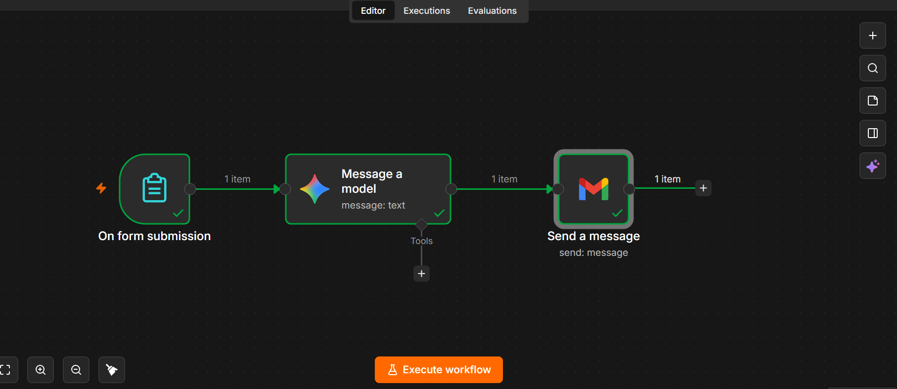

# Mentora

A simple AI mentor automation built using n8n, Gemini and Gmail.

## How it works

**Form → Gemini → Gmail**

1. User submits a question through the form.
2. Gemini generates a response.
3. The response is sent to the user's email.

## Tech used

* n8n
* Google Gemini
* Gmail

## How to use

Download the `.json` workflow and import it into your n8n account.

You'll need to add your own Gemini API key and Gmail credentials.

## Workflow

